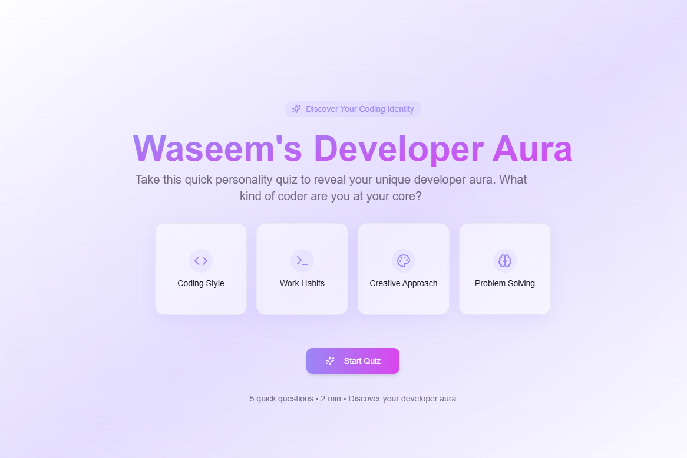

# 🧠 Waseem's Developer Aura Quiz

## ✨ Discover Your Coding Identity

Ever wondered what type of developer you truly are? **Waseem's Developer Aura Quiz** is an interactive personality test that reveals your unique developer personality based on your preferences and habits.

[Try the Quiz Live](https://lovable.dev/projects/6296334a-7274-411e-b70e-3295e0ea2fe0) | [View on GitHub](https://github.com/your-username/developer-aura-quiz)

## 🚀 Features

- **Interactive Quiz Experience**: Answer 5 engaging questions about your coding habits and preferences
- **Beautiful UI/UX**: Enjoy a visually stunning interface with smooth animations and transitions
- **Personal Results**: Receive a unique developer aura result with a custom title, description, and emoji
- **Sharable Results**: Download your result as an image to share with friends or on social media
- **Mobile Responsive**: Works perfectly on all devices - from smartphones to desktops
- **Smooth Animations**: Enhanced user experience with Framer Motion animations
- **Modern Stack**: Built with React, TypeScript, Tailwind CSS, and Vite

## 📸 Screenshots

<div align="center">
  
</div>

<div align="center">
  
</div>

## 🛠️ Technologies Used

- **React**: Modern, component-based UI library
- **TypeScript**: For type safety and better developer experience
- **Tailwind CSS**: Utility-first CSS framework for rapid UI development
- **Framer Motion**: For smooth, physics-based animations
- **Vite**: Next-generation frontend tooling for fast development
- **html2canvas**: For generating downloadable result images
- **shadcn/ui**: High-quality UI components
- **Lucide Icons**: Beautiful, consistent icon set

## 🧪 Possible Developer Auras

The quiz identifies five distinct developer auras:

- **The Visionary Pioneer** 🚀: A forward-thinking developer who's always exploring new technologies
- **The Pragmatic Craftsperson** 🛠️: A detail-oriented developer who values stable, clean solutions
- **The Creative Problem-Solver** 💡: A developer who finds innovative ways to tackle challenging problems
- **The Analytical Architect** 📊: A methodical developer who excels at creating robust systems
- **The Developer Sage** 🧠: A wise developer with deep knowledge who others turn to for guidance

## 🚀 Getting Started

### Run Locally

```bash
# Clone the repository
git clone https://github.com/your-username/developer-aura-quiz.git

# Navigate to the project directory
cd developer-aura-quiz

# Install dependencies
npm install

# Start the development server
npm run dev
```

Visit `http://localhost:5173` to see the app in action!

## 📝 License

This project is open source and available under the [MIT License](LICENSE).

## 👨‍💻 About the Creator

Created with ❤️ by Waseem. Connect with me on [GitHub](https://github.com/your-username) or [Twitter](https://twitter.com/your-twitter).

---

<p align="center">
  <b>Find your developer aura today!</b>
</p>
